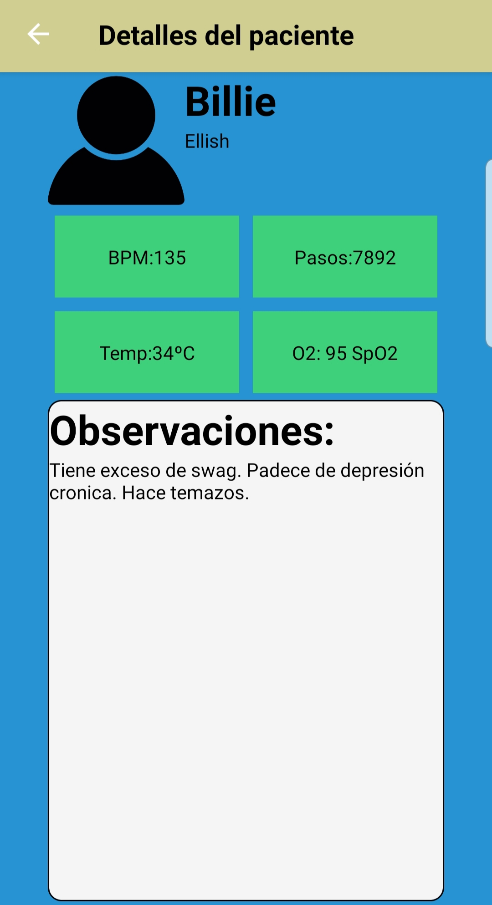

# PROYECTO ARGOS


**Introducción**
 
Esta es la aplicación presentada como TFG(Trabajo de final de grado) en la [Universidad de Alicante](https://www.ua.es/). Lo que se ha querido realizar es un sistema de monitorización para personas en riesgo. Esto proyecto tiene partes de Hardware y Software. Además, hay dos repositorios más donde se encuentra el código para el hardware, y el codigo para la API.

+ [Repositorio API](https://github.com/JaimeSarrion/ArgosAPI)
+ [Repositorio Hardware](https://github.com/JaimeSarrion/ArgosHardware)

# Guia de instalación

La instalación de la app es muy sencilla, pero primero hay que desplegar la API (ver el repositorio de la API). Una vez está desplegada simplemente hemos de:

+ Instalamos la ultima versión de [Node](https://nodejs.org/en/download/)
+ Instalar el cliente de expo: ``` npm install -g expo-cli ```
+ Vamos a la carpeta raiz del proyecto: ``` cd Argos```


## Ejecución

+ Para iniciar el servidor: ```npm start```

## Funcionalidades

Lo que podrás realizar en esta aplicación:

- Hacer login 
- Registrate
- Consultar los pacientes de un médico
- Ver los detalles del paciente
- Ver las constantes del paciente
- Ver las observaciones del paciente

# Arquitectura del sistema


# Autores

- [Jaime Sarrión](www.linkedin.com/in/jaime-sarrion-sahuquillo)

# Licencias

Este proyecto está bajo la licencia GNU GPL v3 - revisa  [LICENSE](https://es.wikipedia.org/wiki/GNU_General_Public_License)  para ver más detalles.


## Historias de usuario


|Nombre                |Descripción                          |URL                         |
|----------------|-------------------------------|-----------------------------|
|**Login de usuario**|Como médico quiero registrarme y logearme para poder entrar a páginas restringidas sólo para mi.            |[Login de usuario](https://github.com/JaimeSarrion/ArgosApp/wiki/SGT-1-Login-de-usuario)            |
|**Listado de usuarios**          | Como médico quiero saber que pacientes están a mi cargo para tener conocimiento de la cantidad de pacientes que tengo a mi cargo | [Listado de usuarios](https://github.com/JaimeSarrion/ArgosApp/wiki/STG-2---Listado-de-usuarios) |
|**Detalles del usuario**          | Como médico quiero ver los detalles de un paciente para ver sus pulsaciones, oxigeno en sangre, pasos y temperatura | [Detalles del usuario](https://github.com/JaimeSarrion/ArgosApp/wiki/SGT---3-Detalles-del-usuario)|

# Pantallas de la aplicación

### Login


### Menu principal


### Listado de pacientes


### Detalles del paciente


